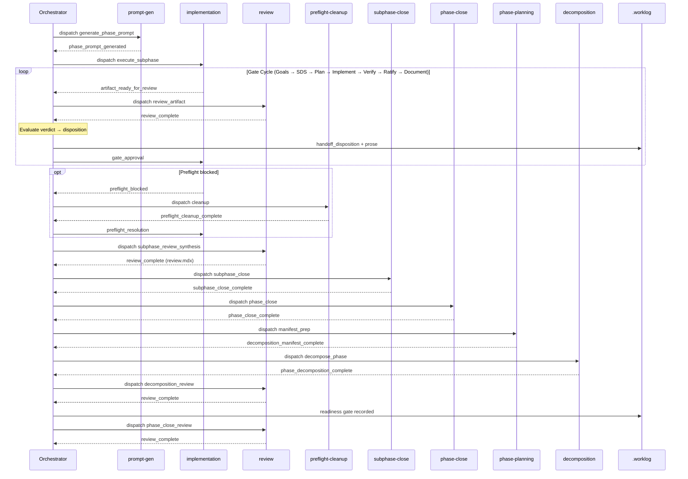

**Human-only overview. Not a runtime contract for agents.**

**Canonical runtime source of truth:**

- `SKILL.md`
- `orchestrator/ENTRY.md`
- `implementation-prompt-gen/ENTRY.md`
- `implementation-agent/ENTRY.md`
- `review-agent/ENTRY.md`

If this README conflicts with runtime docs, runtime docs win.

## Migration Note

This skill's naming history is:

- `pfc` → `cortex` → `orchestrator`

For this skill, treat any legacy `pfc` or `cortex` reference as `orchestrator`.

## Contract Alignment

This README is aligned to:

- `.skills/.contracts/agent-identity-routing-contract.md`
- `.skills/.contracts/handoff-contract.md`
- `.skills/.contracts/execution-boundary-contract.md`

## Canonical Actors (This Skill Scope)

| Class | Node | Canonical ID | Responsibility |
| --- | --- | --- | --- |
| `Orchestrator` | `engineer-workflow` | `Orchestrator::engineer-workflow` | Owns orchestration, gate decisions, dispositions, and phase transition control for this skill. |
| `Worker` | `prompt-gen` | `Worker::prompt-gen` | Generates sub-phase implementation prompts. |
| `Worker` | `implementation` | `Worker::implementation` | Produces artifacts and code for each sub-phase. |
| `Worker` | `review` | `Worker::review` | Performs gate reviews and returns structured review handoffs. |
| `Worker` | `preflight-cleanup-exec` | `Worker::preflight-cleanup-exec` | Executes deterministic pre-flight cleanup operations (parent-repo non-submodule dirty-tree + branch readiness) and returns cleanup status. |
| `Worker` | `phase-planning-exec` | `Worker::phase-planning-exec` | Prepares decomposition-input manifests during phase transition. |
| `Worker` | `decomposition` | `Worker::decomposition` | Produces next-phase decomposition output. |
| `Worker` | `subphase-close-exec` | `Worker::subphase-close-exec` | Executes deterministic sub-phase close operations (commit/push/PR/merge/sync) and returns close status. |
| `Worker` | `phase-close-exec` | `Worker::phase-close-exec` | Executes deterministic phase-close Stage 1 operations and returns phase-close completion status. |

## Invariants Applied

- `Worker::*` handoffs route only to `Orchestrator::engineer-workflow`.
- `Orchestrator::engineer-workflow` is the only control endpoint in this skill.
- No worker lane may bypass the orchestrator lane.
- Repository mutation operations (cleanup/commit/push/merge) run only in dispatched worker lanes; Orchestrator governs by packeted dispatch/completion.
- Every consumed handoff requires a disposition packet plus prose summary before the next dispatch.
- The six-artifact sub-phase model remains mandatory:
  - Goals
  - SDS
  - Implementation Plan
  - Completion Report
  - User Documentation
  - Review

## Entry Points

| Entry Point | Mode | Entry File |
| --- | --- | --- |
| `EP-001` | `role_router` | `SKILL.md` |
| `EP-002` | `task_orchestrator` | `orchestrator/ENTRY.md` |
| `EP-003` | `phase_planning_exec` | `exec-agent/ENTRY.md` |
| `EP-004` | `phase_decomposition` | `decomposition-agent/ENTRY.md` |
| `EP-005` | `preflight_cleanup_exec` | `preflight-agent/ENTRY.md` |
| `EP-006` | `subphase_close_exec` | `close-agent/ENTRY.md` |
| `EP-007` | `phase_close_exec` | `phase-close-agent/ENTRY.md` |
| `EP-008` | `implementation_prompt_gen` | `implementation-prompt-gen/ENTRY.md` |
| `EP-009` | `implementation_agent` | `implementation-agent/ENTRY.md` |
| `EP-010` | `review_agent` | `review-agent/ENTRY.md` |

## Entrypoint Step Paths

### EP-001 — Role Router

| Step | Action | Primary Surface | Outcome |
| --- | --- | --- | --- |
| `1` | Read `entrypoint_mode_slug` and `entrypoint_mode_slugs` frontmatter. | `SKILL.md` | Mode context loaded |
| `2` | Match requested mode to canonical role-entry mapping. | `SKILL.md`, `.skills/.contracts/skills-registry.yaml` | Target lane selected |
| `3` | Route execution to selected entry lane (`EP-002`..`EP-010`). | `SKILL.md` | Routed |
| `4` | Stop router lane. | `SKILL.md` | Terminal |

### EP-002 — Task Orchestrator

| Step | Action | Primary Surface | Outcome |
| --- | --- | --- | --- |
| `1` | Run scope guard and admissibility checks. | `orchestrator/ENTRY.md` | Valid ingress or fail-close |
| `2` | Dispatch prompt generation worker. | `orchestrator/templates/implementation-prompt-gen-dispatch-prompt.md` | Prompt-gen dispatched |
| `3` | Consume `phase_prompt_generated`, disposition it, validate single-packet invariants, then dispatch implementation lane with the generated plain-text prompt artifact. | `implementation-prompt-gen/responses/prompt-generated.md`, `implementation-prompt-gen/templates/phase-prompt.md` | Implementation running |
| `4` | For each artifact-ready handoff, dispatch review worker. | `orchestrator/templates/gate-review-prompt.md` | Review cycle active |
| `5` | Consume `review_complete`, emit `handoff_disposition` packet + prose, then emit `gate_approval`. | `orchestrator/responses/handoff-disposition.md`, `orchestrator/responses/gate-approval.md` | Gate advanced or revision requested |
| `6` | If preflight blocked, dispatch preflight cleanup worker and then emit preflight resolution. | `orchestrator/templates/preflight-cleanup-dispatch-prompt.md`, `orchestrator/responses/preflight-resolution.md` | Preflight resolved or blocked |
| `7` | After user-documentation approval, dispatch synthesis review worker (`review.mdx`). | `orchestrator/templates/subphase-review-dispatch-prompt.md` | Synthesis complete |
| `8` | Dispatch sub-phase close worker and consume completion handoff. | `orchestrator/templates/subphase-close-dispatch-prompt.md`, `orchestrator/responses/subphase-close-complete.md` | Sub-phase closed |
| `9` | If final sub-phase, execute phase-transition dispatch chain (phase-close, manifest, decomposition, decomposition review, readiness remediation loop, phase-close review). | `orchestrator/procedures/phase-transition.md` | Next phase readiness or blocked |

### EP-003 — Phase Planning Exec

| Step | Action | Primary Surface | Outcome |
| --- | --- | --- | --- |
| `1` | Run scope guard (`Worker::phase-planning-exec`). | `exec-agent/ENTRY.md` | Valid ingress or fail-close |
| `2` | Read Stage 2 planning requirements and source precedence. | `exec-agent/ENTRY.md`, `orchestrator/procedures/phase-transition.md` | Inputs validated |
| `3` | Create/update `decomposition-input-manifest.mdx` with required sections. | `exec-agent/ENTRY.md` | Manifest ready |
| `4` | Emit `decomposition_manifest_complete`. | `orchestrator/responses/decomposition-manifest-complete.md` | Handoff sent |
| `5` | Stop and wait for next ingress packet. | `exec-agent/ENTRY.md` | Terminal |

### EP-004 — Phase Decomposition

| Step | Action | Primary Surface | Outcome |
| --- | --- | --- | --- |
| `1` | Run scope guard (`Worker::decomposition`). | `decomposition-agent/ENTRY.md` | Valid ingress or fail-close |
| `2` | Consume decomposition manifest + Stage 2 constraints. | `decomposition-agent/ENTRY.md` | Inputs validated |
| `3` | Produce next-phase sub-phase specs in `.architecture/roadmap/phase-(X+1)/`. | `decomposition-agent/ENTRY.md` | Specs ready |
| `4` | Emit `phase_decomposition_complete`. | `orchestrator/responses/phase-decomposition-complete.md` | Handoff sent |
| `5` | Stop and wait for next ingress packet. | `decomposition-agent/ENTRY.md` | Terminal |

### EP-005 — Preflight Cleanup Exec

| Step | Action | Primary Surface | Outcome |
| --- | --- | --- | --- |
| `1` | Run scope guard (`Worker::preflight-cleanup-exec`). | `preflight-agent/ENTRY.md` | Valid ingress or fail-close |
| `2` | Inspect dirty scope in parent repo non-submodule paths only (submodule repos/branches/gitlink refs are ignored in pre-flight). | `preflight-agent/ENTRY.md` | Scope mapped |
| `3` | Commit parent repo non-submodule updates grouped by concern. | `preflight-agent/ENTRY.md` | Parent clean |
| `4` | Align/create target sub-phase branch and verify readiness. | `preflight-agent/ENTRY.md` | Branch ready |
| `5` | Confirm parent-repo non-submodule tree is clean and branch requirements are satisfied. | `preflight-agent/ENTRY.md` | Ready |
| `6` | Emit `preflight_cleanup_complete`. | `orchestrator/responses/preflight-cleanup-complete.md` | Handoff sent |

### EP-006 — Subphase Close Exec

| Step | Action | Primary Surface | Outcome |
| --- | --- | --- | --- |
| `1` | Run scope guard (`Worker::subphase-close-exec`). | `close-agent/ENTRY.md` | Valid ingress or fail-close |
| `2` | Commit submodule changes first. | `close-agent/ENTRY.md` | Submodule commit phase complete |
| `3` | Commit parent repo changes grouped by concern. | `close-agent/ENTRY.md` | Parent commit phase complete |
| `4` | Push submodules and sub-phase branch. | `close-agent/ENTRY.md` | Remote updated |
| `5` | Open and merge PR (`phase-X.Y/*` → `phase-X`). | `close-agent/ENTRY.md` | Merge complete |
| `6` | Sync/push `phase-X`. | `close-agent/ENTRY.md` | Phase branch synchronized |
| `7` | Emit `subphase_close_complete`. | `orchestrator/responses/subphase-close-complete.md` | Handoff sent |

### EP-007 — Phase Close Exec

| Step | Action | Primary Surface | Outcome |
| --- | --- | --- | --- |
| `1` | Run scope guard (`Worker::phase-close-exec`). | `phase-close-agent/ENTRY.md` | Valid ingress or fail-close |
| `2` | Generate required phase-close artifacts (`subphase-merge-audit`, `e2e-*`, `acceptance-audit`, `roadmap-sync-record`). | `phase-close-agent/ENTRY.md` | Artifacts written |
| `3` | Execute verification + dynamic E2E and reconciliation loop if needed. | `phase-close-agent/ENTRY.md` | Checks resolved or blocked |
| `4` | Merge `phase-X` into `dev` and sync `dev` branch. | `phase-close-agent/ENTRY.md` | Merge/sync complete |
| `5` | Perform branch cleanup under policy. | `phase-close-agent/ENTRY.md` | Cleanup complete |
| `6` | Emit `phase_close_complete`. | `orchestrator/responses/phase-close-complete.md` | Handoff sent |

### EP-008 — Implementation Prompt Gen

| Step | Action | Primary Surface | Outcome |
| --- | --- | --- | --- |
| `1` | Run scope guard (`Worker::prompt-gen`). | `implementation-prompt-gen/ENTRY.md` | Valid ingress or fail-close |
| `2` | Read template + phase spec + previous completion/review + ADR index. | `implementation-prompt-gen/ENTRY.md` | Inputs loaded |
| `3` | Fill all variables in phase prompt template and include canonical envelope. | `implementation-prompt-gen/templates/phase-prompt.md` | Prompt complete |
| `4` | Emit `phase_prompt_generated` packet with plain-text prompt artifact (no nested packet envelope) and stop disposable lane. | `implementation-prompt-gen/responses/prompt-generated.md` | Terminal |

### EP-009 — Implementation Agent

| Step | Action | Primary Surface | Outcome |
| --- | --- | --- | --- |
| `1` | Run scope guard and branch/tree preflight checks. | `implementation-agent/ENTRY.md` | Ready or `preflight_blocked` |
| `2` | Execute gate sequence: Goals → SDS → Plan → Implement → Verify → Ratify → Document. | `implementation-agent/ENTRY.md` | Artifact progression |
| `3` | After each artifact/revision, emit packet-only `artifact_ready_for_review` and wait. | `implementation-agent/responses/artifact-ready-for-review.md` | Approval-needed state |
| `4` | On implementation blockers, emit `execution_blocked` and wait for `execution_resolution`. | `implementation-agent/responses/execution-blocked.md`, `orchestrator/responses/execution-resolution.md` | Blocked/resolved |
| `5` | On verify blockers, emit `verify_blocked` and wait for `verify_resolution`. | `implementation-agent/responses/verify-blocked.md`, `orchestrator/responses/verify-resolution.md` | Blocked/resolved |
| `6` | Do not commit; do not edit `.skills/`; stop at valid terminal handoff states only. | `implementation-agent/ENTRY.md` | Contract-compliant terminal |

### EP-010 — Review Agent

| Step | Action | Primary Surface | Outcome |
| --- | --- | --- | --- |
| `1` | Run scope guard (`Worker::review`). | `review-agent/ENTRY.md` | Valid ingress or fail-close |
| `2` | Read dispatched artifact + review template + required context only. | `review-agent/ENTRY.md` | Review context loaded |
| `3` | Write/append review file at dispatched output path. | `review-agent/ENTRY.md` | Review artifact written |
| `4` | Emit `review_complete` packet and stop. | `review-agent/responses/review-complete.md` | Terminal |

## Detailed Path (Step + Handoff)

| Step | Source → Target | Action | Primary Surface | Required |
| --- | --- | --- | --- | --- |
| `1` | Role Router → `Orchestrator::engineer-workflow` | Resolve lane and route to entry point | `SKILL.md` | yes |
| `2` | `Orchestrator::engineer-workflow` → `Worker::prompt-gen` | Dispatch phase prompt generation | `orchestrator/templates/implementation-prompt-gen-dispatch-prompt.md` | yes |
| `3` | `Worker::prompt-gen` → `Orchestrator::engineer-workflow` | Return `phase_prompt_generated` packet with filled plain-text phase prompt | `implementation-prompt-gen/responses/prompt-generated.md` | yes |
| `4` | `Orchestrator::engineer-workflow` → `Worker::implementation` | Dispatch sub-phase execution | `implementation-prompt-gen/templates/phase-prompt.md` | yes |
| `5` | `Worker::implementation` → `Orchestrator::engineer-workflow` | Emit artifact-ready packet | `implementation-agent/responses/artifact-ready-for-review.md` | yes |
| `6` | `Orchestrator::engineer-workflow` → `Worker::review` | Dispatch gate review | `orchestrator/templates/gate-review-prompt.md` | yes |
| `7` | `Worker::review` → `Orchestrator::engineer-workflow` | Return review completion | `review-agent/responses/review-complete.md` | yes |
| `8` | `Orchestrator::engineer-workflow` → internal state machine | Record disposition decision event + prose summary (no downstream routing target) | `orchestrator/responses/handoff-disposition.md` | yes |
| `9` | `Orchestrator::engineer-workflow` → `Worker::implementation` | Emit gate approval/revision result | `orchestrator/responses/gate-approval.md` | yes |
| `10` | `Worker::implementation` → `Orchestrator::engineer-workflow` | Optional preflight blocked packet | `implementation-agent/responses/preflight/*.md` | optional |
| `11` | `Orchestrator::engineer-workflow` → `Worker::preflight-cleanup-exec` | Dispatch deterministic pre-flight cleanup execution | `orchestrator/templates/preflight-cleanup-dispatch-prompt.md` | optional |
| `12` | `Worker::preflight-cleanup-exec` → `Orchestrator::engineer-workflow` | Return pre-flight cleanup completion/blocked status | `orchestrator/responses/preflight-cleanup-complete.md` | optional |
| `13` | `Orchestrator::engineer-workflow` → `Worker::implementation` | Optional preflight resolution | `orchestrator/responses/preflight-resolution.md` | optional |
| `14` | `Orchestrator::engineer-workflow` → `Worker::review` | Dispatch sub-phase synthesis review (`review.mdx`) | `orchestrator/templates/subphase-review-dispatch-prompt.md` | yes |
| `15` | `Worker::review` → `Orchestrator::engineer-workflow` | Return synthesis review completion | `review-agent/responses/review-complete.md` | yes |
| `16` | `Orchestrator::engineer-workflow` → `Worker::subphase-close-exec` | Dispatch deterministic sub-phase close execution | `orchestrator/templates/subphase-close-dispatch-prompt.md` | yes |
| `17` | `Worker::subphase-close-exec` → `Orchestrator::engineer-workflow` | Return sub-phase close completion/blocked status | `orchestrator/responses/subphase-close-complete.md` | yes |
| `18` | `Orchestrator::engineer-workflow` → `Worker::phase-close-exec` | Dispatch deterministic phase-close Stage 1 execution | `orchestrator/templates/phase-close-dispatch-prompt.md` | yes |
| `19` | `Worker::phase-close-exec` → `Orchestrator::engineer-workflow` | Return phase-close completion/blocked status | `orchestrator/responses/phase-close-complete.md` | yes |
| `20` | `Orchestrator::engineer-workflow` → `Worker::phase-planning-exec` | Dispatch decomposition-input manifest preparation | `orchestrator/templates/decomposition-manifest-dispatch-prompt.md` | yes |
| `21` | `Worker::phase-planning-exec` → `Orchestrator::engineer-workflow` | Return manifest completion | `orchestrator/responses/decomposition-manifest-complete.md` | yes |
| `22` | `Orchestrator::engineer-workflow` → `Worker::decomposition` | Dispatch phase decomposition | `orchestrator/templates/phase-decomposition-dispatch-prompt.md` | yes |
| `23` | `Worker::decomposition` → `Orchestrator::engineer-workflow` | Return decomposition completion | `orchestrator/responses/phase-decomposition-complete.md` | yes |
| `24` | `Orchestrator::engineer-workflow` → `Worker::review` | Dispatch decomposition review | `orchestrator/templates/decomposition-review-dispatch-prompt.md` | yes |
| `25` | `Worker::review` → `Orchestrator::engineer-workflow` | Return decomposition review completion | `review-agent/responses/review-complete.md` | yes |
| `26` | `Orchestrator::engineer-workflow` → `.worklog` | Record readiness gate state transition for next phase | `orchestrator/procedures/phase-transition.md` | yes |
| `27` | `Orchestrator::engineer-workflow` → `Worker::preflight-cleanup-exec` | Optional readiness remediation dispatch when `phase-(X+1)` branch is missing | `orchestrator/templates/preflight-cleanup-dispatch-prompt.md` | optional |
| `28` | `Worker::preflight-cleanup-exec` → `Orchestrator::engineer-workflow` | Optional readiness remediation completion/blocked status | `orchestrator/responses/preflight-cleanup-complete.md` | optional |
| `29` | `Orchestrator::engineer-workflow` → `Worker::review` | Dispatch phase-close review artifact generation | `orchestrator/templates/phase-close-review-dispatch-prompt.md` | yes |
| `30` | `Worker::review` → `Orchestrator::engineer-workflow` | Return phase-close review completion | `review-agent/responses/review-complete.md` | yes |

## Flow Diagram

```mermaid
flowchart LR
  subgraph ENTRY["Entry"]
    RR(["Role Router"])
  end

  subgraph PROMPT_GEN["Prompt Generation"]
    ORCH0["Orchestrator"]
    WPG["Worker::prompt-gen"]
    ORCH0 -->|dispatch| WPG
    WPG -->|phase_prompt_generated| ORCH0
  end

  subgraph PREFLIGHT["Preflight"]
    PB{"preflight\nblocked?"}
    ORCHP["Orchestrator"]
    WPF["Worker::preflight-cleanup-exec"]
    PB -->|yes| ORCHP
    ORCHP -->|dispatch cleanup| WPF
    WPF -->|cleanup_complete| ORCHP
  end

  subgraph GATE_CYCLE["Gate Cycle"]
    direction TB
    WIMPL["Worker::implementation"]
    ORCH2["Orchestrator"]
    WREV["Worker::review"]
    DISP(["disposition\nrecorded"])
    GATE{"more\nartifacts?"}
    WIMPL -->|artifact_ready| ORCH2
    ORCH2 -->|dispatch review| WREV
    WREV -->|review_complete| ORCH2
    ORCH2 --> DISP --> GATE
    GATE -->|yes| WIMPL
    GATE -.->|gate_approval| WIMPL
  end

  subgraph CLOSE["Sub-phase Close"]
    direction TB
    WREV2["Worker::review"]
    ORCH6["Orchestrator"]
    WSC["Worker::subphase-close-exec"]
    WREV2 -->|review_complete| ORCH6
    ORCH6 -->|dispatch close| WSC
    WSC -->|close_complete| ORCH6
  end

  subgraph PHASE_TRANSITION["Phase Transition"]
    direction TB
    WPC["Worker::phase-close-exec"]
    ORCH9["Orchestrator"]
    WPLAN["Worker::phase-planning-exec"]
    WDECOMP["Worker::decomposition"]
    WREV3["Worker::review"]
    READY(["readiness gate\nrecorded"])
    WREV4["Worker::review"]
    TERM(["next phase\nready"])

    WPC -->|phase_close_complete| ORCH9
    ORCH9 -->|dispatch manifest| WPLAN
    WPLAN -->|manifest_complete| ORCH9
    ORCH9 -->|dispatch decompose| WDECOMP
    WDECOMP -->|decomposition_complete| ORCH9
    ORCH9 -->|dispatch review| WREV3
    WREV3 -->|review_complete| ORCH9
    ORCH9 --> READY
    READY -->|dispatch close review| WREV4
    WREV4 -->|review_complete| TERM
  end

  RR --> ORCH0
  ORCH0 -->|dispatch subphase| WIMPL
  WIMPL --> PB
  PB -->|no| ORCH2
  ORCHP -->|preflight_resolution| WIMPL
  GATE -->|no| WREV2
  ORCH6 -->|dispatch synthesis review| WREV2

  ORCH6 --> MORE{"more\nsub-phases?"}
  MORE -->|yes| ORCH0
  MORE -->|no| WPC

  classDef orchestrator fill:#1a1a1a,stroke:#FFD54F,stroke-width:1.5px,color:#EDEDED;
  classDef worker fill:#1a1a1a,stroke:#FA5D2B,stroke-width:1px,color:rgba(255,255,255,0.85);
  classDef decision fill:#141414,stroke:#555,stroke-width:1px,color:rgba(255,255,255,0.7);
  classDef event fill:#141414,stroke:#333,stroke-width:1px,color:rgba(255,255,255,0.55);
  classDef lane fill:#0f0f0f,stroke:#222,stroke-width:1px,color:rgba(255,255,255,0.38);

  class ORCH0,ORCH2,ORCHP,ORCH6,ORCH9 orchestrator;
  class WPG,WIMPL,WREV,WPF,WSC,WPC,WPLAN,WDECOMP,WREV2,WREV3,WREV4 worker;
  class PB,GATE,MORE decision;
  class DISP,READY,TERM,RR event;
```

## Sequence Diagram



## Handoff Visibility Points

| ID | Direction | Surface | Purpose | Required |
| --- | --- | --- | --- | --- |
| `HF-DISP` | internal control event in `Orchestrator::engineer-workflow` | `orchestrator/responses/handoff-disposition.md` | Durable disposition/state-transition transparency per consumed handoff | yes |
| `HF-PRE-CLEAN` | `Worker::preflight-cleanup-exec` → `Orchestrator::engineer-workflow` | `orchestrator/responses/preflight-cleanup-complete.md` | Deterministic pre-flight cleanup completion handoff before implementation resumes | optional |
| `HF-PRE-RSLV` | `Orchestrator::engineer-workflow` → `Worker::implementation` | `orchestrator/responses/preflight-resolution.md` | Resolve preflight blockers before execution resumes | optional |
| `HF-GATE` | `Orchestrator::engineer-workflow` → `Worker::implementation` | `orchestrator/responses/gate-approval.md` | Gate verdict handoff to implementation lane | yes |
| `HF-REVIEW-SYNTH` | `Worker::review` → `Orchestrator::engineer-workflow` | `review-agent/responses/review-complete.md` | Final sub-phase review synthesis completion handoff (`review.mdx`) | yes |
| `HF-CLOSE` | `Worker::subphase-close-exec` → `Orchestrator::engineer-workflow` | `orchestrator/responses/subphase-close-complete.md` | Deterministic close completion handoff before next sub-phase dispatch | yes |
| `HF-PHASE-CLOSE` | `Worker::phase-close-exec` → `Orchestrator::engineer-workflow` | `orchestrator/responses/phase-close-complete.md` | Deterministic phase-close Stage 1 completion handoff | yes |
| `HF-MANIFEST` | `Worker::phase-planning-exec` → `Orchestrator::engineer-workflow` | `orchestrator/responses/decomposition-manifest-complete.md` | Durable manifest completion handoff | yes |
| `HF-DECOMP` | `Worker::decomposition` → `Orchestrator::engineer-workflow` | `orchestrator/responses/phase-decomposition-complete.md` | Durable decomposition completion handoff | yes |
| `HF-DECOMP-REVIEW` | `Worker::review` → `Orchestrator::engineer-workflow` | `review-agent/responses/review-complete.md` | Decomposition review completion handoff | yes |
| `HF-PHASE-CLOSE-REVIEW` | `Worker::review` → `Orchestrator::engineer-workflow` | `review-agent/responses/review-complete.md` | Phase-close review completion handoff (`Cortex-phase-close-review.mdx`) | yes |

## Example Handoff Packet

Every handoff between agents is a structured YAML-frontmatter packet followed by a body. Here's what a real `handoff_disposition` packet looks like — this is the Orchestrator recording its gate decision after reviewing a completion report:

```yaml
---
nous:
  v: 2
  route:
    emitter:
      class: Orchestrator
      node: engineer-workflow
      id: Orchestrator::engineer-workflow
    target:
      class: Orchestrator
      node: engineer-workflow
      id: Orchestrator::engineer-workflow
  envelope:
    direction: internal
    type: response_packet
    workflow: engineer-workflow-sop
    action: handoff_disposition
  correlation:
    handoff_id: HF-DISPOSITION-001
    correlation_id: phase-1.2-completion-report-cycle-1
    cycle: 1
    emitted_at_utc: 2026-02-23T19:49:06.250Z
    emitted_at_unix_ms: 1771876146250
    sequence_in_run: 7
  payload:
    schema: handoff-disposition.v1
    artifact_type: completion-report
  retry:
    policy: value-proportional
    depth: iterative
    importance_tier: high
    expected_quality_gain: 0.25
    estimated_tokens: 1800
    estimated_compute_minutes: 1.0
    token_price_ref: .worklog/benchmarks/pricing-rates-stub.mdx
    compute_price_ref: .worklog/benchmarks/pricing-rates-stub.mdx
    decision: accept
    decision_log_ref: .worklog/phase-1/phase-1.2/reviews/completion-report.mdx
    benchmark_tier: nightly
    self_repair:
      required_on_fail_close: true
      orchestration_state: deferred
      approval_role: Cortex:System
      implementation_mode: dispatch-team
      plan_ref: .worklog/benchmarks/self-repair/full-plan-todo.mdx
---

source_handoff_id: HF-008
disposition_status: accepted
decision_ref: .worklog/phase-1/phase-1.2/reviews/completion-report.mdx
next_action: advance_to_next_gate
next_dispatch_ref: n/a
```

Key things to notice:

- **`nous.v: 2`** — protocol version for packet schema
- **`route`** — who emitted and who receives (both Orchestrator here, since dispositions are internal state events)
- **`envelope`** — packet type, workflow, and action name
- **`correlation`** — links this packet to a specific artifact review cycle with timestamps and sequence number
- **`payload.schema`** — declares which schema validates the body
- **`retry`** — cost-aware decision metadata: token estimates, quality gain, and whether to accept/revise
- **`retry.self_repair`** — if the gate fails closed, the system can attempt automated repair via the dispatch team
- **Body** — the actual disposition: accepted, with a ref to the review log and what happens next

This packet structure is what makes the multi-agent workflow auditable — every decision, every handoff, every gate verdict is a durable, traceable record.

## Optional External Boundary Packets

These templates remain available for external principal-bridge integrations, but they are outside this skill's internal orchestrator/worker lane model:

- `orchestrator/responses/principal-e2e-handoff-request.md`
- `orchestrator/responses/principal-e2e-execution-report.md`
- `orchestrator/responses/principal-carry-forward-approval.md`
- `orchestrator/responses/principal-creative-direction-signoff.md`

## Maintenance

- Update runtime contracts first (`SKILL.md`, role `ENTRY.md`, templates/procedures).
- Keep mirrored templates synchronized with `scripts/check-template-sync.ps1`.
- Re-run validators:
  - `python .skills/.system/skill-creator/scripts/quick_validate.py .skills/engineer-workflow-sop`
  - `pwsh -File .skills/engineer-workflow-sop/scripts/check-reinforcement-contract.ps1`
  - `pwsh -File .skills/engineer-workflow-sop/scripts/check-template-sync.ps1`
- Refresh this README after runtime changes.
